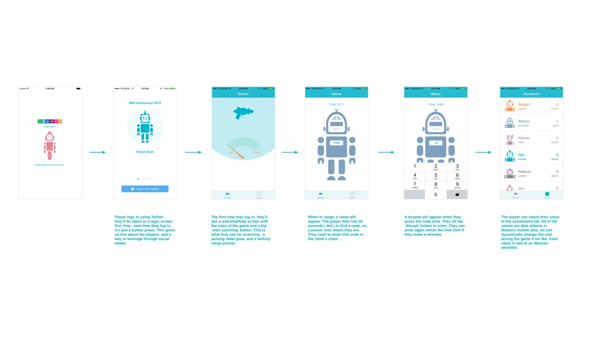

Robot Scanner
-------------

Robot Hunt is a physically interactive game in which players at a conference can use their iOS device to 'scan' for 'robots' in the conference area. 

The app, and the game require the player's device to be connected to the internet in order to login and play.

Robots are personified by iBeacons. A player's device will reveal a picture of a robot when they walk within range of an iBeacon designated to represent that robot. 

Players then have a limited time to locate a four digit code on a nearby poster that shows a picture of the same robot. [ The posters are 8 feet tall and recognizable ]. Players need to enter the code into the robot's chest on the device, in order to 'disrupt' the robot and earn a 'disruption point'.

Each 'disruption point' will equate to an entry for that player in a raffle.

No robots are harmed during gameplay ... just disrupted briefly.

The app was designed and is intended to be used at the upcoming IBM InterConnect 2015 [ Feb 22 - 26 ] Conference, and will be evolved for other IBM conferences and events in the future.

- - - - - - -

This iOS code is twinned with a [mobile back end app](https://hub.jazz.net/project/antonm/robot/overview "Robot Hunt Back End") 

It also depends on the IBM Mobile First Frameworks. For [more information please see]( http://www.ibm.com/developerworks/library/mo-ios-mobiledata-app/ )